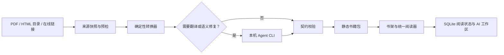

<p align="center">
  
</p>

# GoodReader

GoodReader 是一个面向 macOS 的本地书架与统一阅读器。它把 PDF、本地 HTML 目录和公开网页转换为受控的静态 HTML 书籍包，在同一个桌面应用中管理阅读进度、高亮、笔记、书签和书籍 AI 工作区。

项目的核心原则是：书籍正文保持不可变，所有阅读状态由 GoodReader 外置管理；书籍制作在本机完成，AI 能力复用用户已经配置好的 Codex、Claude Code、Cursor 或自定义 CLI，不在 GoodReader 中保存模型 API Key。

> 当前版本：`0.2.7`。项目仍处于早期阶段，当前发行目标是 macOS 13+、Apple Silicon。

## 功能概览

- 统一书架：封面、书名、作者和阅读进度集中展示。
- 多来源制书：支持数字 PDF、本地 HTML 目录和公开在线链接。
- 可选中文翻译：非中文来源可通过本机 Agent 翻译为简体中文，并可保留正文块级原文。
- 统一阅读体验：目录、前后章、阅读进度、明暗主题和沉浸式顶部栏。
- 阅读标注：支持高亮、笔记和以选中文字为锚点的书签。
- 书籍 AI：在阅读区侧栏中进行摘要、问答和书籍制作协作。
- 持久化生成任务：支持后台运行、暂停、恢复、失败重试和详细进度事件。
- 本地优先：书籍、阅读状态、任务历史和 AI 工作区均保存在本机。

## 工作方式



GoodReader 负责来源复制、静态化、稳定 ID、脚本清理、图片与链接检查以及最终契约校验。Agent 只承担翻译和需要语义判断的候选工作，不能直接绕过校验发布书籍。

## 支持范围

| 来源 | 当前支持 | 说明 |
| --- | --- | --- |
| 数字 PDF | 是 | 提取文本和语义图片，生成可重排 HTML |
| 扫描 PDF | 暂不支持 | 需要本地 OCR 模型，已列入后续计划 |
| 本地 HTML | 是 | 复制来源快照，移除原始可执行脚本并转换为书籍契约 |
| 在线链接 | 是 | 支持公开页面和用户确认范围内的同源章节，不处理登录与付费墙 |
| 简体中文翻译 | 是 | 使用本机 Agent CLI；可以选择是否保留块级原文 |

## 开发环境

建议环境：

- macOS 13 或更高版本
- Apple Silicon
- Node.js 20.19+ 或 22.12+
- Rust stable
- Xcode / Xcode Command Line Tools

安装依赖并启动开发版：

```bash
npm ci
npm run tauri -- dev
```

只构建前端：

```bash
npm run frontend:build
```

构建 macOS 应用和 DMG：

```bash
DEVELOPER_DIR=/Applications/Xcode.app/Contents/Developer npm run tauri -- build
```

## 验证

```bash
npm run test:import-ui
npm run test:reader-typography
cargo fmt --check --manifest-path src-tauri/Cargo.toml
cargo test --manifest-path src-tauri/Cargo.toml -- --test-threads=1
```

部分真实 PDF 和生成书籍验收测试依赖未纳入仓库的大型本地资源，默认标记为 `ignored`。准备好对应资源后，可以显式运行：

```bash
cargo test --manifest-path src-tauri/Cargo.toml -- --ignored --test-threads=1
```

## 书籍接入契约

GoodReader 最终只阅读符合契约的静态 HTML 书籍包。`book.json` 是书籍身份、元数据、入口和章节顺序的唯一权威来源：

```json
{
  "schemaVersion": 1,
  "id": "不可变 UUID",
  "title": "展示书名",
  "author": "作者",
  "language": "zh-CN",
  "cover": "assets/cover.png",
  "entry": "index.html",
  "chapters": [
    {
      "id": "chapter-0001",
      "title": "第一章",
      "path": "chapters/chapter-0001.html"
    }
  ]
}
```

章节中的可标注正文块必须拥有稳定且全书唯一的 `data-goodreader-block`。书籍不能执行自有脚本；目录、主题、进度、标注和原文展示统一由 GoodReader 注入的阅读器运行时接管。

## 本地数据

默认数据目录：

```text
~/Library/Application Support/GoodReader/
├── Books/         # 已生成的静态书籍包
├── ImportTasks/   # 持久化制书任务与检查点
├── AgentTasks/    # 书籍 AI 任务工作区
├── Data/          # SQLite 阅读状态
└── Backups/       # 数据库备份
```

这些目录以及发行包、PDF 输入和生成书籍均不进入版本管理。

## 项目结构

```text
frontend/          TypeScript 阅读器与书架界面
src-tauri/         Rust 后端、Tauri 桌面封装和应用图标
scripts/           可重复的界面与排版检查
docs/              产品设计、接入契约和架构决策
CONTEXT.md         项目领域语言与核心概念
```

## 设计文档

- [V1 产品与技术规格](docs/V1-SPEC.md)
- [多来源书籍生成方案](docs/BOOK-IMPORT-DESIGN.md)
- [Agent 集成设计](docs/AGENT-INTEGRATION-DESIGN.md)
- [架构决策记录](docs/adr)
- [后续计划](docs/BACKLOG.md)

## 当前限制

- 扫描 PDF 和混合 PDF 的 OCR 尚未实现。
- 在线来源不支持登录、付费墙或需要人工交互的页面。
- 当前发行包采用本地 ad-hoc 签名，尚未接入 Apple 公证流程。
- 当前主要针对 macOS Apple Silicon 验证，其他平台图标存在但未作为正式发行目标。
