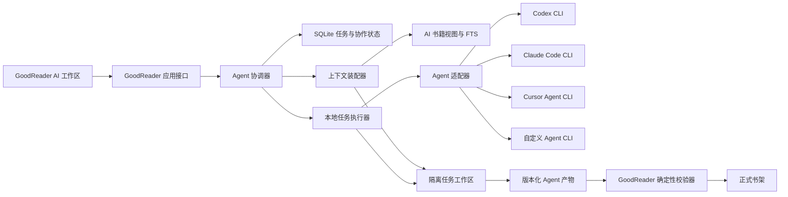
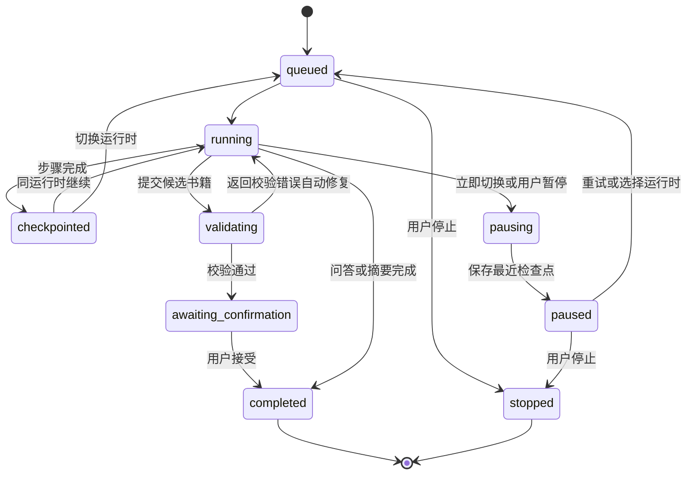
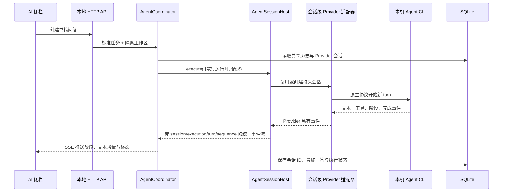

# Agent 能力整合方案

本文档记录 GoodReader 复用本机 Agent CLI，为书籍摘要、基于书籍的问答和书籍制作提供 AI 能力的已确认设计。本文档是后续实现的产品与架构契约；实施应按文末阶段推进。

## 目标

- GoodReader 为用户提供统一的书籍 AI 入口。
- 复用本机已有的 Codex、Claude Code、Cursor Agent 等 Agent 运行时。
- Agent 运行时继续独立管理自己的账号认证、API 密钥、模型选择和用户级配置。
- GoodReader 不建设第二套模型供应商配置，也不读取、保存或同步 Agent 运行时的密钥。

## 已确认边界

- GoodReader 是书籍、阅读状态、Agent 任务及产物的宿主。
- Agent CLI 是独立进程，不作为库链接进 GoodReader。
- GoodReader 通过受控的进程调用向 Agent CLI 提交任务，并消费其结构化输出。
- 本机当前的 Codex、Claude Code 与 Cursor Agent 都支持非交互调用和结构化输出，但会话恢复、权限控制及事件格式并不相同，不能把它们视为同一协议的不同模型。

### 任务与运行时解耦

- Agent 任务不永久绑定某一个 Agent 运行时。
- 同一个 Agent 任务允许在 Codex、Claude Code、Cursor Agent 等可用运行时之间切换。
- 运行时切换不能依赖不同 CLI 之间互相识别对方的原生会话；跨运行时的任务连续性必须由 GoodReader 提供。

### GoodReader 持有任务状态

- GoodReader 是 Agent 任务状态的唯一权威来源，Agent CLI 是可替换的执行器。
- GoodReader 保存任务目标、用户指令、引用书籍、已确认结论、已接受产物和执行记录。
- 每次执行前，GoodReader 将必要状态整理为标准化任务上下文包。
- 同一运行时可以恢复自身原生会话；切换运行时后创建新会话，并通过任务上下文包接续任务。
- CLI 的内部推理、隐藏上下文和私有配置不进入任务上下文包。
- 每次执行及其产物都记录实际使用的 Agent 运行时，以便追溯。

### 隔离的任务工作区

- Agent CLI 不直接访问 GoodReader 数据库、正式书架或其他书籍。
- GoodReader 为每个 Agent 任务准备独立的任务工作区，输入只读，候选产物写入单独目录。
- 摘要和问答任务只获得任务涉及的书籍内容；书籍制作任务只获得明确选择的书籍来源。
- GoodReader 使用各 Agent 运行时支持的最严格适用权限模式限制执行范围。
- Agent 生成的书籍必须先进入暂存区，通过书籍接入契约校验并经用户确认后，才能进入正式书架。
- Agent 不能直接修改原始书籍、阅读状态或阅读标注。

### 无模型依赖的书籍检索

- GoodReader 为静态书籍包派生只读的 AI 书籍视图，保留章节、正文块稳定标识和图片引用。
- GoodReader 提供纯本地的关键词全文检索，不要求嵌入模型、向量数据库或额外 API 配置。
- Agent 运行时负责根据任务反复检索、读取命中内容并完成理解、推理和生成。
- 基于书籍生成的回答应引用章节和正文块，引用可以跳回书籍原文。
- 未来可以增加可选语义检索能力，但它不能成为 GoodReader Agent 能力的运行前提。

### 持久化本地执行

- GoodReader 使用独立的本地任务执行器调度 Agent 任务和管理 Agent CLI 进程。
- 关闭 GoodReader 窗口不会取消正在运行的任务；重新打开界面后可以恢复进度展示。
- 长任务按步骤保存状态和检查点，CLI 异常退出后可以从最近完成的步骤继续。
- 用户显式停止任务时，本地任务执行器必须终止对应 CLI 进程。
- 短问答与长任务共用任务基础设施，但界面表现可以保持即时对话体验。
- 本地任务执行器不读取或保存模型密钥、模型选择和供应商配置。

### 步骤边界上的运行时切换

- 同一 Agent 任务同一时间最多允许一个 Agent 执行写入候选产物。
- 默认在当前步骤完成并形成任务检查点后切换运行时，下一步骤由新的运行时接续。
- 用户选择立即切换时，本地任务执行器终止当前 CLI，丢弃尚未完成和校验的本步骤产物，并从最近任务检查点重新执行。
- 已完成、已接受的结果和产物保留在任务上下文包中，不因运行时切换而丢失。
- 多个运行时并行生成用于比较的结果属于任务分支，不允许并发写入同一任务产物。

### 统一的任务能力策略

- GoodReader 在任务开始前声明统一的任务能力策略，各 Agent 适配器负责映射为对应 CLI 的权限和沙箱参数。
- 摘要和问答任务只读取指定书籍及其本地检索结果，不修改书籍，也不授权浏览外部来源。
- 书籍制作任务可以读取指定来源、在任务工作区写候选产物，并运行明确允许的转换工具。
- 在线链接来源需要额外的指定来源抓取能力；CLI 连接自身模型服务不计为任务浏览外部来源。
- GoodReader 在任务开始前集中展示能力范围，不让用户逐条审批底层命令。
- 执行中需要扩大能力时，任务必须暂停并由 GoodReader 请求用户授权。
- GoodReader 不使用无边界执行模式；某个 CLI 无法落实任务能力策略时，该运行时对该任务不可用。

### 运行时发现与初始选择

- GoodReader 自动发现支持的本机 Agent CLI，并检查路径、版本、登录状态和基本可用性。
- 用户首次使用时选择偏好运行时，只选择 CLI，不在 GoodReader 中选择模型或配置账号。
- 新任务默认使用偏好运行时，任务界面始终显示当前运行时并允许更换。
- GoodReader 可以按任务类型记住最近使用的运行时，但这只是初始选择，不构成任务绑定。
- 当前运行时不可用时暂停任务并提示用户选择其他可用运行时，不静默切换。
- GoodReader 不根据任务内容自动选择所谓最佳模型。
- GoodReader 为 Codex、Claude Code 和 Cursor Agent 提供内置适配器，同时允许用户自行添加其他本机 Agent CLI。
- 自定义 Agent 运行时仍由其自身管理认证、模型和服务配置，GoodReader 只保存调用与能力描述。

### 自定义 CLI 的渐进增强契约

- 用户可以通过可执行文件路径和参数模板添加自定义 Agent 运行时。
- 最低契约要求 CLI 支持非交互执行、通过标准输入或上下文文件接收任务、通过标准输出和退出码返回结果、在指定任务工作区运行，并能由本地任务执行器终止。
- 满足最低契约的 CLI 可以参与任务历史共享和运行时切换；GoodReader 在切换时通过任务上下文包重建上下文，不要求 CLI 原生恢复会话。
- JSONL 流式输出、原生会话恢复、JSON Schema、登录检查、权限映射、进度事件和工具调用事件属于可选增强能力。
- 缺少增强能力时只降级相应体验，不拒绝整个运行时；例如没有流式输出时显示统一的执行中状态。
- Codex、Claude Code 和 Cursor Agent 的内置适配器预先声明并实现其受支持的增强能力。

### 文件契约优先的数据通道

- 任务工作区以稳定的目录和文件格式提供任务说明、书籍清单、分章节 AI 书籍视图、阅读标注、共享协作历史、已有产物和候选产物目录。
- 能读取本地文件的 Agent CLI 不依赖专有工具协议即可参与任务。
- GoodReader 提供本地检索工具，用于全文搜索、按正文块读取书籍内容和查询共享历史；具备工具调用能力的 Agent 可以反复使用。
- MCP 可以作为同一组检索能力的增强通道，但不是 Agent 运行时的基础接入条件。
- 不具备工具调用能力的 CLI 由 GoodReader 预先检索并装配相关内容，其可用性保留，但多轮自主检索能力相应降级。

### 追加历史与版本化产物

- 普通问答和协作消息按时间追加到书籍 AI 工作区，不为每条消息单独创建产物版本。
- 摘要、提纲、笔记建议、章节和候选书籍等可复用结果作为 Agent 产物保存，并采用版本化模型。
- Agent 每次修改产物时创建新版本，不能直接覆盖已经接受的版本。
- 用户可以比较版本、恢复旧版本，或选择一个版本交给其他 Agent 运行时继续工作。
- 每个产物版本记录生成运行时、生成时间、任务检查点和引用来源。
- 正式静态书籍包仍需通过书籍接入契约校验并经用户确认后一次性进入书架。

### 任务内自主，任务外确认

- 用户明确提出摘要、问答、比较或书籍制作目标后，即视为授权启动对应 Agent 任务，不额外要求确认执行计划。
- Agent 可以在已声明的任务能力策略内自主检索、读取共享历史、调用工具、分解步骤和生成版本化产物。
- Agent 可以建议新的后续任务，但不能自行启动用户未要求的新目标。
- 产物进入正式书架、建议转为正式阅读标注、扩大任务能力或更换书籍来源时，需要用户确认。
- Agent 运行时切换由用户发起，Agent 不能自行更换运行时。
- GoodReader 不逐条审批任务能力范围内的底层工具调用。

### 按需生成摘要

- 导入书籍时只生成 AI 书籍视图和本地全文索引，不自动调用 Agent 生成摘要。
- 用户首次打开书籍摘要或明确提出总结要求时，创建摘要任务。
- 摘要作为版本化 Agent 产物保存，并记录覆盖章节、引用来源和生成运行时。
- 新增阅读标注和协作结论不会自动重做摘要；GoodReader 可以提示摘要生成后发生的变化，由用户决定是否更新。
- 更新摘要创建新版本，不覆盖旧摘要。
- 用户可以生成全书概要、逐章摘要或结合阅读标注的个人总结等不同摘要产物。

### 书籍制作的生成与校验闭环

- Agent 在任务工作区生成候选静态书籍包，不修改原始书籍来源。
- GoodReader 使用自身确定性校验器检查书籍清单、章节、正文块、图片、链接和脚本接入契约，不采信 Agent 对完成状态的自我声明。
- 校验失败时，GoodReader 将结构化错误报告写入共享任务历史，并交回当前 Agent 自动修复候选产物。
- 自动修复属于已经授权的书籍制作目标，不要求用户逐轮确认。
- 连续失败且没有进展、需要扩大任务能力或 Agent 声明无法完成时，任务暂停并请求用户处理。
- 用户可以切换其他 Agent 运行时，从最近候选版本和完整校验历史继续修复。
- 只有校验通过的候选版本才能预览，并在用户确认后一次性进入正式书架。

### 有限自动恢复

- CLI 启动失败、未登录、额度不足或任务能力不满足时不自动重试，任务暂停并展示原因。
- 书籍导入以 PDF 单页和翻译批次作为幂等检查点；模型容量不足、限流、服务端错误、网络中断或空响应等临时故障最多执行 6 次，按 5、15、30、60、120 秒有界退避；PDF 单页执行超时也适用这一策略。
- PDF 单页返回无法通过结构校验的结果时最多执行 3 次短间隔重试；翻译结构校验失败或单批超时时优先将批次二分，避免反复提交同一份过大的输入。
- 每次自动重试都写入持久化事件，展示失败原因、下次执行序号和等待时间；等待期间仍可暂停或取消任务。
- 超过重试上限或遇到未知错误时，任务从最近检查点暂停；已校验的 PDF 页面、译文和候选文件不重做。
- 用户可以选择同一运行时重试、切换其他运行时接续、打开对应 CLI 完成配置，或停止任务。
- 失败不删除共享历史、任务检查点和已有候选产物；GoodReader 展示易懂摘要并保留完整执行日志。
- GoodReader 不静默切换运行时，也不无限自动重试。

### 书籍级共享协作历史

- 每本书拥有一个本地书籍 AI 工作区，保存围绕该书产生的摘要、问答、书籍制作过程、任务历史和产物。
- 同一本书可以由多个不同 Agent 运行时协作；所有参与该书工作的运行时共享书籍 AI 工作区中的历史和知识。
- 摘要、问答和书籍制作不是彼此失忆的孤立空间，后续 Agent 可以利用此前 Agent 的讨论、结论和产物继续工作。
- GoodReader 持有共享历史的权威记录，不能依赖某一个 CLI 的私有会话维持协作连续性。
- 共享发生在用户本机；不同 Agent 运行时之间通过 GoodReader 的任务上下文包交换已有知识。
- 不同书籍仍各自拥有独立的书籍 AI 工作区。
- GoodReader 完整保存书籍 AI 工作区的协作历史，所有参与该书工作的 Agent 运行时都可以检索和读取。
- 每次执行默认装配当前目标、近期对话、关键结论、已有产物目录和相关历史；较早的完整历史保持可检索，不要求每次全部塞入模型上下文。
- 按需装配只用于控制上下文规模和保持生成质量，不构成历史权限隔离。

### 阅读标注作为共享知识

- 用户的高亮、笔记和书签进入对应的书籍 AI 工作区，供参与该书工作的所有 Agent 运行时检索和使用。
- GoodReader 必须保留知识来源，明确区分书籍正文、用户阅读标注和 Agent 生成结论。
- Agent 不能把用户笔记表述成原书观点；基于书籍的回答仍需引用对应正文依据。
- Agent 对现有阅读标注保持只读；Agent 生成的新笔记先作为建议产物，只有用户确认后才能成为正式阅读标注。

### 数据生命周期

- 移除书籍只让静态书籍包离开书架，完整保留阅读状态和书籍 AI 工作区。
- 相同书籍标识重新导入后，恢复原来的摘要、问答历史、Agent 产物和阅读标注。
- 移除书籍时仍在执行的 Agent 任务先暂停并保存最近任务检查点。
- “清除 AI 工作区”只删除任务历史、Agent 产物和执行日志，不删除书籍内容、阅读进度或阅读标注。
- “永久忘记”删除该书全部用户数据，包括阅读状态、阅读标注和书籍 AI 工作区，但不删除静态书籍包或原始来源文件。

## 总体架构



### 模块职责

| 模块 | 负责 | 不负责 |
| --- | --- | --- |
| Agent 协调器 | 任务状态、步骤、检查点、运行时切换、失败恢复 | 调用具体 CLI 参数、模型选择 |
| 运行时注册表 | 自动发现、用户添加、偏好运行时、健康与能力状态 | 自动挑选所谓最佳模型 |
| Agent 适配器 | 将统一执行请求映射为具体 CLI 的启动、输入、事件、恢复和终止 | 保存任务权威状态 |
| 本地任务执行器 | 后台调度、进程生命周期、日志、重连 | 保存 API 密钥、解释书籍语义 |
| 上下文装配器 | 从共享历史、书籍、标注和产物生成任务上下文包 | 保存 CLI 隐藏推理 |
| AI 书籍视图 | 将章节、正文块、图片引用转换为稳定可检索文本 | 改写正式书籍内容 |
| 本地检索工具 | 全文搜索、读取正文块、查询共享历史 | 模型推理、向量嵌入 |
| Agent 产物仓库 | 保存摘要、提纲、笔记建议和候选书籍版本 | 直接覆盖已接受版本 |
| 书籍校验器 | 验证 GoodReader 接入契约并生成结构化错误 | 相信 Agent 的完成声明 |

### 关键分层

1. 书籍、阅读标注、任务状态和产物属于 GoodReader。
2. 认证、模型选择、服务地址和供应商配置属于 Agent CLI。
3. Agent 适配器只转换进程协议，不承载产品业务逻辑。
4. 本地任务执行器只编排本机进程，不成为模型代理服务。
5. “本地运行”表示 CLI、任务数据和编排在用户的 Mac 上；CLI 是否调用远程模型由其自身配置决定，GoodReader 不宣称离线 AI。

## 统一执行模型

### 任务与执行

- `AgentTask` 表示用户目标，例如总结全书、回答一组问题或制作书籍。
- `AgentExecution` 表示某个运行时对任务的一次具体执行。
- 一个任务可以包含多次执行，并在执行之间切换运行时。
- 同一任务同时最多有一个可写执行；并行比较必须创建任务分支。
- CLI 原生会话标识只附着在一次运行时轨迹上，不能成为任务身份。

### 任务状态



- `failed` 是一次 Agent 执行的结果，不直接销毁整个任务。
- 需要登录、额度不足、能力不满足和有副作用的中断都把任务置为 `paused`。
- 只有用户明确停止才进入 `stopped`；关闭窗口不是停止操作。

### 运行时切换

- “当前步骤完成后切换”先形成检查点，再用新的运行时创建执行。
- “立即切换”终止当前进程，丢弃未完成步骤，从最近检查点创建执行。
- 新运行时获得相同书籍 AI 工作区、任务目标、相关历史和产物版本。
- 同一运行时可以用原生会话恢复；跨运行时一律通过任务上下文包重建。

## Agent 适配器契约

### 内置适配器

首批内置 Codex、Claude Code 和 Cursor Agent 适配器。每个内置适配器实现：

- 可执行文件发现和版本探测；
- 登录与健康状态检查；
- 非交互启动和工作目录设置；
- 文本、JSON 或 JSONL 事件解析；
- 任务能力策略到 CLI 权限参数的映射；
- 原生会话创建与恢复；
- 中断、取消和退出码分类。

### 自定义运行时

用户可以添加其他 CLI。GoodReader 保存的是运行时接入信息，不是模型配置。建议的最小描述如下：

```json
{
  "schemaVersion": 1,
  "id": "my-agent",
  "name": "My Agent",
  "executable": "/absolute/path/to/my-agent",
  "arguments": ["--print"],
  "input": { "mode": "stdin" },
  "output": { "format": "text" },
  "capabilities": {
    "streaming": false,
    "nativeResume": false,
    "structuredOutput": false,
    "permissionMapping": false,
    "toolUse": true
  }
}
```

- 参数按数组保存和启动，不拼接成 shell 字符串。
- 最低能力是非交互输入、标准输出、退出码、指定工作区和进程终止。
- 没有原生会话恢复时，GoodReader 用任务上下文包创建新会话。
- 没有流式事件时，界面显示统一执行状态并在退出后接收完整结果。
- 运行时声明不足以满足某类任务时，只禁用该类任务，不影响它执行其他任务。

### 统一事件

各适配器把 CLI 输出归一化为少量 GoodReader 事件：

- `execution.started`
- `message.delta`
- `message.completed`
- `tool.started`
- `tool.completed`
- `artifact.created`
- `checkpoint.created`
- `permission.required`
- `execution.completed`
- `execution.failed`

原始输出写入执行日志；业务状态只消费归一化事件。

## 任务工作区契约

```text
AgentTasks/<task-id>/
├── task.json
├── context/
│   ├── current.md
│   ├── history.jsonl
│   └── decisions.json
├── book/
│   ├── book.json
│   ├── chapters/
│   │   └── <chapter-id>.md
│   ├── annotations.jsonl
│   └── assets.json
├── artifacts/
│   └── <artifact-id>/
│       └── <version>/
├── output/
└── logs/
```

- `task.json` 声明目标、当前步骤、能力策略、当前运行时和输出契约。
- `context/current.md` 是本次执行直接装配的上下文；完整历史仍可通过文件或检索工具访问。
- `book/` 是只读 AI 书籍视图，不是正式书籍包副本。
- `artifacts/` 向 Agent 暴露明确选定的既有产物版本。
- `output/` 是本次执行唯一可写的候选产物入口。
- GoodReader 数据库和正式 `Books/` 目录不出现在任务工作区中。

## 书籍知识与引用

### AI 书籍视图

- 每个章节转换为包含章节 ID、正文块 ID、正文文本和图片引用的 Markdown 或等价结构化文本。
- 书籍正文、用户标注和 Agent 结论分别标记 `book`、`reader`、`agent` 来源。
- 图片至少记录资源路径、所在正文块、标题和替代文字；需要视觉理解时由任务显式把图片文件加入工作区。
- 书籍内容不可变时，AI 书籍视图可以按书籍标识缓存；重新导入相同标识后重建并校验。

### 本地检索

- 使用 SQLite FTS5 对章节标题、正文块、阅读标注和共享协作历史建立纯本地全文索引。
- 检索结果返回书籍 ID、章节 ID、正文块 ID、来源类型、命中文本和相关度。
- Agent 可以通过本地检索命令反复搜索并读取指定正文块；可选 MCP 暴露相同语义。
- 首版不构建向量索引，也不配置嵌入模型。

### 引用

- 基于书籍的回答和摘要引用必须指向章节 ID 与正文块 ID。
- 界面把引用渲染为可点击入口，跳转到原文锚点。
- 引用用户笔记时必须显示为“你的笔记”，不能伪装成书籍原文。
- 无法找到书籍依据时，Agent 应明确标记为推断或共享历史观点。

## 当前运行时执行架构

书籍问答采用 Claudian 式持久执行会话：`AgentSessionHost` 是对调用方唯一可见的深模块，按“书籍 ID + 运行时 ID”持有 Provider 原生进程和会话状态。GoodReader 业务层只处理统一、带关联范围的执行事件，不解析 Provider 私有格式；协议、进程复用、异常重建和取消都封装在内部适配器中。



| 运行时 | 执行通道 | 会话恢复 | 流式输出 | 停止 |
| --- | --- | --- | --- | --- |
| Codex | 持久 `codex app-server --stdio` JSON-RPC | 同一进程复用 thread；重建时 `thread/resume` | `item/agentMessage/delta` | `turn/interrupt` 后回收异常连接，按 thread 恢复 |
| Claude Code | 持久 `--input-format stream-json --output-format stream-json` | 同一进程连续输入；重建时 `--resume <session-id>` | `content_block_delta` | 回收当前流进程，后续按 session 恢复 |
| OpenCode | `opencode run --format json` 原生事件流 | 后续 turn 使用 `--session <session-id>` | `text` 事件 | 终止当前进程，后续按 session 恢复 |
| Cursor Agent | 兼容 CLI 适配器 | 共享上下文包重建 | 完成后输出 | 终止进程组 |
| 自定义 CLI | 标准输入、标准输出与退出码 | 共享上下文包重建 | 完成后输出 | 终止进程组 |

统一事件包含 turn 开始、阶段变化、会话状态、文本增量、思考增量、工具开始/完成、turn 完成、取消和分类错误。每个事件携带不可变的 `sessionInstanceId`、`executionId`、`turnId` 和单调递增 `sequence`。AI 侧栏通过 SSE 直接消费事件，不再以固定间隔轮询；初始任务快照带最后序号，能够消除重连窗口中的重复增量。

Provider 原生会话按“书籍 ID + 运行时 ID”保存在 `agent_sessions`，运行期间由同键的 `AgentSessionHost` 会话复用一个 CLI 进程。它只负责同一 Provider 的高效续接；`ai_messages` 和稳定会话工作区中的 `context/history.jsonl` 仍是跨 Provider 共享历史的权威来源。清除 AI 工作区或永久忘记书籍时，先释放对应进程，再删除原生会话记录。

导入、翻译等需要 JSON Schema 的批处理暂时保留专用结构化执行路径，因为它们的成功条件是确定性的完整 JSON，而不是对话增量。两条路径共享运行时发现、进程隔离和日志目录，但不强行合并不同的输出语义。

## 持久化模型

建议在现有 SQLite 中增加以下逻辑实体：

| 实体 | 关键关系与职责 |
| --- | --- |
| `agent_runtimes` | 内置或自定义运行时、路径、参数、能力、健康状态；不保存模型密钥 |
| `book_ai_workspaces` | 以书籍 UUID 为唯一外键，维护共享历史版本和索引状态 |
| `agent_tasks` | 目标、类型、状态、能力策略、当前步骤、当前运行时 |
| `agent_executions` | 一次 CLI 调用、运行时、原生会话 ID、开始结束时间、结果和错误 |
| `agent_sessions` | 每本书、每个运行时的原生会话 ID 与少量 Provider 状态 |
| `task_checkpoints` | 可恢复步骤、上下文版本和选定产物版本 |
| `ai_messages` | 用户与 Agent 的追加式协作消息及来源运行时 |
| `agent_artifacts` | 逻辑产物身份、类型、当前接受版本 |
| `artifact_versions` | 内容位置、生成执行、父版本、校验状态和创建时间 |
| `ai_citations` | 消息或产物到章节、正文块、阅读标注和其他产物的引用 |
| `task_events` | 归一化执行事件，用于进度恢复和问题排查 |

- 共享历史、摘要等文本产物和元数据进入 SQLite，并纳入现有数据库备份。
- 大型候选书籍、执行日志和临时文件保存在任务工作区；未接受候选不承诺由 SQLite 备份恢复。
- 候选书籍被接受后进入正式书架，不在 AI 产物目录重复保存完整副本。

## 用户体验

### 书籍 AI 工作区

- 每本书提供统一 AI 入口，包含协作时间线、输入框、当前运行时选择器、任务进度和产物区域。
- 摘要、问答和书籍制作共享该书历史；切换运行时后继续显示同一时间线。
- 运行时选择器显示名称、可用性和当前任务能力，不展示或修改模型 API 配置。
- 回答中的引用可以直接跳回阅读器正文。
- Agent 建议转为笔记时先显示预览，由用户确认后写入正式阅读标注。

### 后台任务中心

- 显示正在运行、暂停、等待确认和最近完成的任务。
- 关闭窗口不取消任务，重新打开后从本地任务执行器恢复进度。
- 运行时需要登录或配置时，提供“打开对应 CLI”而不是在 GoodReader 内配置账号。
- 切换运行时提供“当前步骤后切换”和“立即切换”两个明确动作。

### 摘要与书籍制作

- 导入书籍只建立 AI 书籍视图和全文索引，不自动生成摘要。
- 摘要按需生成，标明覆盖范围、来源和版本；新增笔记后只提示更新，不自动重做。
- 书籍制作以候选包、校验报告和预览为核心，不把 Agent 文本回复视为交付完成。

## 任务能力模板

| 任务 | 默认读取 | 默认写入 | 额外能力 |
| --- | --- | --- | --- |
| 书籍问答 | 当前书籍、标注、共享历史 | 追加消息 | 无 |
| 书籍摘要 | 当前书籍、标注、共享历史 | 新摘要版本 | 无 |
| 笔记建议 | 当前书籍、标注、共享历史 | 建议产物 | 用户确认后写正式笔记 |
| 本地来源制书 | 指定来源、共享历史 | 候选书籍目录 | 运行允许的转换工具 |
| 在线来源制书 | 指定 URL、共享历史 | 候选书籍目录 | 抓取指定来源 |
| 校验修复 | 候选书籍、校验报告 | 新候选版本 | 不扩大原任务能力 |

## 实施阶段

### 阶段 0：技术验证

- 用真实 Codex、Claude Code、Cursor Agent 验证非交互执行、结构化流、取消、会话恢复和权限映射。
- 验证本地任务执行器与 Tauri 窗口关闭、应用重连和异常退出的生命周期。
- 固定统一事件和自定义运行时最低契约。

### 阶段 1：Agent 基础设施

- 建立运行时注册表、三个内置适配器和自定义 CLI 配置。
- 建立本地任务执行器、任务状态机、检查点、统一日志和能力策略。
- 建立任务工作区与 SQLite 数据模型迁移。

### 阶段 2：阅读 AI

- 生成 AI 书籍视图和 FTS5 索引。
- 实现书籍 AI 工作区、共享历史、运行时切换、问答和可点击引用。
- 接入高亮、笔记、书签，并实现按需摘要与版本化产物。

### 阶段 3：书籍制作

- 将 PDF、本地 HTML 目录和在线链接接入书籍制作任务。
- 实现候选产物、确定性校验、自动修复、预览和确认导入闭环。
- 将非中文检测、翻译和可选对照原文作为制书步骤继续压实并实现。

### 阶段 4：增强能力

- 可选 MCP 通道、任务分支比较和可选语义检索。
- 扩展更多内置适配器，但保持自定义 CLI 最低契约稳定。

## 验收标准

1. GoodReader 不保存任何 Agent 的 API 密钥或模型配置。
2. Codex、Claude Code、Cursor Agent 及一个自定义文本 CLI 均能完成最小问答任务。
3. 同一书籍任务可以从一个运行时切换到另一个运行时，并继承共享历史和选定产物。
4. 问答和摘要能引用正文块，点击引用能返回阅读器原文。
5. 高亮、笔记和书签可被 Agent 使用，并始终保留来源身份。
6. 关闭窗口后长任务继续运行，重新打开后能恢复进度。
7. 立即切换不会保留未完成步骤的候选写入，已完成检查点不丢失。
8. 自定义 CLI 缺少流式或原生恢复能力时正确降级，而不是无法使用。
9. Agent 无法直接改写原书、正式阅读标注或正式书架。
10. 候选书籍校验失败后可以由当前或其他 Agent 接续修复，只有通过校验并确认后才能进入书架。
11. 移除书籍后 AI 工作区仍可恢复；清除 AI 工作区和永久忘记遵守各自数据边界。

## 明确不做

- 在 GoodReader 中配置模型供应商、API Key、模型名称或代理地址。
- 把某个 CLI 的原生会话当作 GoodReader 任务的权威状态。
- 强制所有运行时支持 MCP、向量索引或同一事件格式。
- 自动选择所谓最佳 Agent，或在失败时静默切换运行时。
- 让多个 Agent 同时写同一任务产物。
- 让 Agent 绕过 GoodReader 校验直接修改正式书籍或阅读标注。
