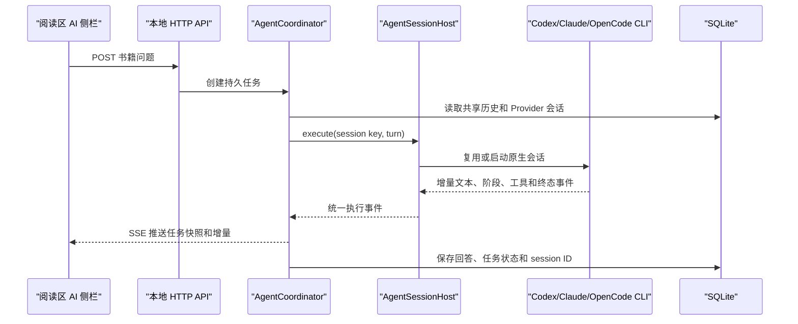

# GoodReader 0.2.10 工作区代码审查说明

## 1. 审查对象

- 基线提交：`df1ca14`（`origin/main`，`feat: initial GoodReader release`）
- 审查目标：当前未提交工作区，包含已跟踪修改和下文列出的新增文件
- 产品版本：`0.2.10`
- 平台：macOS 13+、Apple Silicon、Tauri 2 + Rust + TypeScript
- 总原则：书籍正文不可修改；阅读状态、AI 历史、封面覆盖和生成任务均由 GoodReader 外置管理

建议审查命令：

```bash
git diff --stat df1ca14
git diff --check df1ca14
git diff df1ca14 -- README.md docs frontend scripts src-tauri
git status --short
```

`git diff` 不展示未跟踪文件，审查时还必须单独阅读：

- `src-tauri/src/agent_session.rs`
- `src-tauri/src/pdf_composer.rs`
- `docs/adr/0028-compose-every-pdf-page-with-agent.md`
- `scripts/check-ai-markdown.mjs`
- `scripts/check-ai-stop.mjs`
- `scripts/check-ai-task-status.mjs`
- `scripts/check-cover-replacement.mjs`
- `scripts/check-reader-display-settings.mjs`
- `scripts/check-reader-selection-ai.mjs`

以下内容不是功能代码审查对象：`design-assets/`、`release-assets/`、`frontend/dist/`、`src-tauri/target/`、本地生成书籍和 PDF 输入文件。

## 2. 本轮功能范围

### 2.1 深度 Agent 会话集成

书籍问答由一次性 CLI 调用改为 Provider 原生会话适配：

- Codex：持久 `codex app-server --stdio` JSON-RPC，会话内复用 thread。
- Claude Code：持久 `stream-json` 输入/输出，会话重建时使用 Provider session ID。
- OpenCode：消费原生 JSON 事件，后续 turn 续接 session。
- Cursor 和自定义 CLI：保留兼容的一次性标准输入/输出路径。
- GoodReader 不保存模型 API Key；认证仍由用户在对应 CLI 中完成。
- 同一本书可以切换不同 Agent；`ai_messages` 和书籍工作区是跨 Agent 共享历史，Provider 原生会话仅用于同运行时续接。



关键文件：

| 文件 | 责任 |
| --- | --- |
| `src-tauri/src/agent_session.rs` | Provider 协议、持久进程、会话恢复、统一事件、取消和异常回收 |
| `src-tauri/src/agent.rs` | 运行时发现、书籍上下文工作区、任务编排、SSE 快照、批处理 Agent 路径 |
| `src-tauri/src/db.rs` | `agent_sessions`、共享 AI 历史、任务停止状态和清理事务 |
| `src-tauri/src/models.rs` | 流式任务字段、执行/turn 标识和会话模型 |
| `src-tauri/src/server.rs` | 问答、SSE、重试、停止等 HTTP 接口 |
| `docs/AGENT-INTEGRATION-DESIGN.md` | 当前 Agent 执行架构和 Provider 能力表 |

重要边界：对话问答使用持久 `AgentSessionHost`；翻译和 PDF 页面排版要求完整结构化产物，仍走隔离工作区的一次性 `run_generation`/结构化执行路径。

### 2.2 AI 工作区交互

- AI 工作区位于阅读区右侧栏，不再从书库封面进入。
- 工作区状态、草稿、滚动位置、设置和后台任务状态可以恢复。
- Agent 输出通过 `markdown-it` 渲染；`html: false`，并保留 `[chapter:<chapter-id>#<block-id>]` 的书籍引用按钮。
- 对话移除角色名和发表时间；Agent 回答显示总耗时。
- 任务处理中显示真实运行阶段、已用时间和流式内容。
- “停止请求”会调用后端停止接口、终止活动进程并把任务写为 `stopped`，不能再被旧完成事件改回完成状态。
- Agent 和发送键设置收进侧栏设置区。

### 2.3 选中文字后“问 AI”

- 阅读选区工具栏新增“问 AI”。
- 点击后关闭目录侧栏、打开 AI 侧栏，并预填：`结合上下文内容，讲解这段内容的含义：“选中的内容”。`
- 只预填，不自动发送；用户可以修改后再提交。
- 原文按钮仍按当前正文块是否存在对照原文决定可用或置灰。

### 2.4 阅读显示设置

- 支持调整正文全局字号并持久化 `reader-font-size`。
- 目录侧栏和 AI 侧栏支持拖动改变宽度，分别持久化 `sidebar-width` 和 `ai-sidebar-width`。
- 宽度受视口和各侧栏的最小/最大值约束，窗口变化后重新计算。
- 相关样式集中在 `frontend/public/assets/reader.css`，行为在 `frontend/src/reader.ts`。

### 2.5 替换书籍封面

- 书库书籍菜单新增“替换封面”。
- 后端调用 macOS 文件选择器，接受 PNG、JPEG、GIF、WebP，最大 32 MB。
- 图片保存到 GoodReader 数据目录的 `CoverOverrides/<book-uuid>.<ext>`，不修改原书籍包。
- 删除书籍副本或永久忘记书籍时同步清理封面覆盖。
- 书架和书籍详情统一通过 `/api/books/:book_id/cover` 读取覆盖封面或包内默认封面。

### 2.6 PDF 导入模式和 OCR 边界

导入向导增加三种明确选择：

| 模式 | 行为 |
| --- | --- |
| `auto` | 逐页判断文本层；发现需要 OCR 的正文页时阻止生成并报告页码 |
| `text-layer` | 用户确认使用现有文本层；稀疏页面进入不确定性提示 |
| `ocr` | 明确标记为扫描 PDF；当前版本因本地 OCR 尚未实现而停在预检 |

当前不实现 OCR 模型配置。混合 PDF 只要包含缺少可用正文文本层的页面，就不能静默生成残缺书籍。

### 2.7 PDF 每页由 Agent 排版

旧实现使用文本脚本、目录点线规则和图注正则推断版式与裁图，已被移除。现在每个用户选中的 PDF 页面都必须调用所选 Agent：


页级输入：

- `input/page.png`：统一 144 DPI 页面快照。
- `input/page.json`：页码、图像尺寸、是否检测到嵌入图片，以及带稳定 ID 的来源文本行。
- 重复页眉、页脚和纯页码只被标记为 `removable`；Agent 无权省略其他行。

页级输出 `output/page.json`：

- 块类型限定为 `heading`、`paragraph`、`list`、`quote`、`code`、`table`、`figure`。
- 正文只能引用 `lineIds`，不能让 Agent 提交改写后的正文。
- `figure` 必须提供位于页面像素范围内的非空裁区。
- 检测到嵌入图片的页面至少需要一个 `figure`，否则页面失败。
- 每个不可移除来源行必须且只能出现一次；省略、重复、越界裁图或未知块类型都会失败。

GoodReader 校验输出后，使用原始来源行确定性生成 HTML，并按 Agent 给出的像素区域重新渲染图片。Agent 提供的图注文本不作为正文权威来源；可见图注来自引用的 PDF 来源行。

每页工作区位于 `ImportTasks/<task-id>/pdf-layout/pages/page-NNNN/`。通过校验的 `output/page.json` 是页级检查点：暂停、失败或切换 Agent 后复用完成页；任务成功或取消后清理。

所有 PDF（包括中文数字 PDF）都必须选择可用 Agent。前端在没有 Agent 时禁用“开始生成”，后端再次强制校验，不能绕过 UI。

关键文件：

| 文件 | 责任 |
| --- | --- |
| `src-tauri/src/pdf_composer.rs` | 页级输入/输出契约、Agent 调用、完整性校验和安全 HTML 物化 |
| `src-tauri/src/generation.rs` | PDF 快照、逐页渲染、顺序调度、裁图、进度事件、检查点和最终候选书籍 |
| `frontend/src/main.ts` | PDF 模式、Agent 强制选择、工作量提示和任务进度 |
| `scripts/check-import-progress-ui.mjs` | PDF 模式和 Agent 必选的静态回归检查 |
| `docs/adr/0028-compose-every-pdf-page-with-agent.md` | 逐页 Agent 排版架构决策 |

## 3. 外部接口和持久化变化

新增或扩展的主要 HTTP 接口：

- `GET /api/agent/tasks/:task_id/events`：SSE 任务快照与增量事件。
- `POST /api/agent/tasks/:task_id/stop`：停止当前 AI 请求。
- `GET|POST /api/books/:book_id/cover`：读取或替换封面。
- `POST /api/import/preflight`：增加 `pdfMode`。
- `GET /api/import/tasks/:task_id/events?afterSeq=`：增量读取制书进度详情。

SQLite 变化：

- 新增 `agent_sessions(book_id, runtime_id, provider_session_id, provider_state_json, updated_at)`。
- 清除 AI 工作区或永久忘记书籍时删除对应 Provider 会话。
- `agent_tasks` 的 `stopped` 是终态；迟到的 Provider 完成事件不能覆盖它。

设置键变化：

- `reader-font-size`
- `sidebar-width`
- `ai-sidebar-width`

## 4. 重点审查清单

### Agent 生命周期与并发

- 同一本书、同一运行时的并发 turn 是否被正确串行化。
- Provider 进程退出、协议损坏或网络错误后，session ID 和共享历史是否能够一致恢复。
- SSE 首次快照、递增 `sequence` 和断线重连之间是否存在重复或丢失增量。
- 停止、完成、暂停三个终态竞争时，数据库和 UI 是否可能不一致。
- `cancel_generations_under`、进程组终止与应用退出清理是否覆盖所有子进程。

### 安全与信任边界

- CLI 权限模式和工作目录是否把 Agent 写入限制在任务工作区。
- Markdown 链接协议、引用按钮属性和流式中间 Markdown 是否存在 XSS 或危险导航。
- 自定义 CLI 只有“可执行文件存在”能力判断；当前没有视觉能力声明，可能在 PDF 页级任务中晚失败。
- 封面目前按魔数和大小校验，没有进行完整图片解码或像素尺寸上限检查；需评估解码炸弹风险。

### PDF 内容完整性

- `pdftotext` 行顺序与页面视觉匹配不佳时，Agent 是否有足够信息稳定映射 line ID。
- 多栏、跨页段落、连字符断词、脚注、公式和复杂表格的物化是否符合预期。
- `pdfimages -list` 只对嵌入栅格图提供确定性提示；纯矢量图仍依赖 Agent 视觉判断，无法完全证明没有漏图。
- 144 DPI 页面坐标与 `pdftoppm -x/-y/-W/-H` 裁切坐标是否在不同页面尺寸和旋转页上保持一致。
- 页级缓存输入变化、切换 Agent 和重试时是否会错误复用旧结果。
- 同一页面落入多个章节范围时，图片资源命名和 HTML 引用是否一致。

### 数据与兼容性

- 数据库升级、备份恢复、清除工作区和永久忘记是否正确处理 `agent_sessions`。
- 封面覆盖是否在扫描书库、删除书籍和 UUID 冲突时保持一致。
- 新设置键在非法、过大或旧版本值下是否正确限幅。
- 已导入旧 PDF 不会自动迁移，必须重新导入；确认 UI 和文档没有暗示原地升级。

## 5. 已知限制与非目标

- 当前不实现本地 OCR；扫描 PDF 和需要 OCR 的混合 PDF 会在预检阶段停止。
- PDF 每页顺序调用一次 Agent，速度显著慢于旧脚本；当前优先质量，并依赖页级检查点降低失败重做成本。
- PDF 页面排版不复用对话式持久 Agent 会话；每页是独立结构化工作区，避免跨页输出污染，但会增加进程启动成本。
- 自定义 CLI 没有正式的视觉能力协商协议。
- 纯矢量图片缺少确定性“必须返回 figure”的探测依据。
- 替换封面只影响书架展示，不修改原书包 `book.json` 或封面文件。
- 发行包采用 ad-hoc 签名，未做 Apple 公证。

## 6. 验证记录

已经执行并通过：

```bash
cargo fmt --manifest-path src-tauri/Cargo.toml
cargo test --manifest-path src-tauri/Cargo.toml -- --test-threads=1
npm run test:import-ui
npm run test:ai-task-status
npm run test:ai-markdown
npm run test:ai-stop
npm run test:cover-replacement
npm run test:reader-selection-ai
npm run test:reader-display-settings
npm run test:reader-typography
npm run frontend:build
git diff --check
```

Rust 全量结果：64 通过、0 失败、4 个依赖本地验收资料的测试默认忽略。另单独执行并通过了真实 306 页中文数字 PDF 的预检，以及“中文 PDF 仍必须选择排版 Agent”验收用例。

PDF 页级新增回归覆盖：

- 确认每页实际通过所选 Agent 生成结构化布局。
- 相同输入复用检查点，不重复调用 Agent。
- 遗漏来源行时拒绝页面。
- 中文 PDF 未选择 Agent 时前后端均拒绝开始。

已生成并校验发行包：`release-assets/GoodReader-0.2.10-macOS-arm64-20260806.dmg`。包内版本 `0.2.10`、Bundle ID `studio.xhl.goodreader`、arm64、ad-hoc 签名，DMG CRC 有效；该二进制不是代码审查输入。

## 7. 建议审查输出格式

请审查 Agent 按严重级别输出问题，并且每项包含：

1. 严重级别：P0/P1/P2/P3。
2. 文件与最小行范围。
3. 可复现的失败场景或竞争时序。
4. 为什么现有测试没有覆盖。
5. 最小修复建议和应补充的回归测试。

优先报告会导致正文遗漏或改写、图片不完整、Agent 任务永远运行、停止后复活、跨书会话污染、工作区逃逸、XSS、数据丢失或无法恢复的问题。纯样式偏好和无行为影响的重构建议放在最后。

## 8. 可直接交给审查 Agent 的启动提示

```text
请对 GoodReader 当前未提交工作区做只读代码审查，基线为 df1ca14。

先完整阅读 docs/CODE-REVIEW-HANDOFF-0.2.10.md，再检查 git diff df1ca14、git status --short，以及文档列出的全部未跟踪源码和测试文件。不要只根据文档下结论，必须以实际代码、调用链和测试为证据；不要修改代码、暂存或提交文件。

重点审查：
1. Agent 持久会话、SSE 增量、停止/完成竞争和跨运行时共享历史；
2. PDF 每页 Agent 排版的正文不可变性、行账本、图片完整性、裁区坐标和检查点恢复；
3. Markdown、CLI 工作区、封面文件和本地 HTTP 接口的安全边界；
4. 数据库升级、清理、备份恢复和旧数据兼容；
5. 选区问 AI、字号、侧栏宽度和替换封面的端到端行为。

只报告可操作问题，按 P0/P1/P2/P3 排序。每项给出文件和最小行范围、具体失败场景、影响、现有测试为何未覆盖、最小修复方向和应增加的回归测试。如果没有发现问题，明确说明已检查的关键路径和剩余未验证风险。
```
